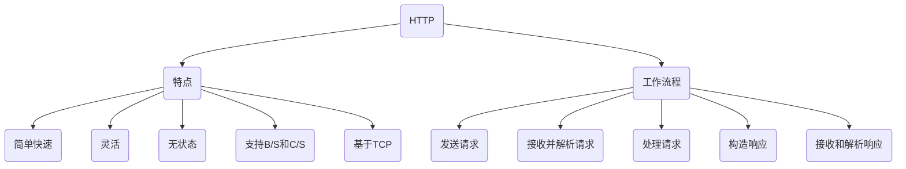

# HTTP 简介

HTTP(Hypertext Transfer Protocol)是互联网上应用最为广泛的一种网络协议。它定义了浏览器和万维网(WWW)服务器之间互相通信的规则。
HTTP 使用 TCP/IP 协议向服务器传送数据。它是一种客户端-服务端(C/S)模型,基于请求-响应模式。工作流程如下:

1. 客户端(浏览器)发送一个 HTTP 请求报文给服务器。
2. 服务器接收并解析请求报文。
3. 服务器进行处理,并构造一个 HTTP 响应报文发送给客户端。
4. 客户端接收和解析服务器返回的响应报文。

## HTTP 特点

1. 支持客户端-服务端模式。
2. 简单快速:客户端向服务器请求服务,服务器响应并在传输完数据后就断开连接。
3. 灵活:支持多种格式(HTML、XML、JSON、图片等)的数据传输。
4. 无状态:每次请求之间相互独立,不能保持状态。
5. 支持 B/S 和 C/S 结构。
6. 基于 TCP 协议:提供可靠的传输服务。

## HTTP 结构

<!--  -->

### 请求方法

HTTP1.0 定义了 3 种请求方法:GET, POST 和 HEAD 方法。
HTTP1.1 新增了 5 种请求方法:OPTIONS, PUT, DELETE, TRACE 和 CONNECT 方法。

### 状态码

HTTP 响应报文第一行为状态行,包含 HTTP 协议版本和状态码。常见状态码有:

- 200 请求成功
- 404 未找到资源
- 500 服务器内部错误

### 请求报文

由请求行、请求头、空行和请求体构成。

- 请求行:方法、URL、版本
- 请求头:主机、用户代理等
- 请求体:可选,包含发送给服务器的数据

### 响应报文

由状态行、消息报头、空行和响应正文 4 个部分组成。

- 状态行:协议版本、状态码
- 消息报头:包含元信息
- 响应正文:HTML、JSON、XML 等

# HTTPS是HTTP的安全版
它通过传输层安全协议加密HTTP报文,保证传输过程的安全性。

## HTTPS工作原理

<!--  -->
HTTPS在HTTP与TCP之间加入了SSL/TLS层,基本工作流程如下:
1. 客户端访问网络服务器,请求与服务器建立SSL连接。客户端发送支持的加密算法和协议版本等信息。
2. 服务器从多个加密算法和协议版本中选定一套,返回数字证书。证书中包含服务器的公钥及证书颁发机构的信息,用于验证服务器的身份。
3. 客户端验证证书的真实性,如果通过验证则生成一个随机数,使用服务器公钥加密后发送给服务器。
4. 服务器使用私钥解密出客户端的随机数,用它生成一个对称加密密钥,用于后续通信加密。
5. 服务器把密钥用客户端的公钥加密后发送给客户端。
6. 客户端解密获得对称加密密钥,用于解密服务器发来的信息和加密要发送给服务器的信息。
7. 客户端和服务器使用对称加密算法和密钥进行加密通信,完成传输并断开SSL连接。
   
整个过程通过证书验证服务器身份,公钥加密传输对称加密密钥,然后使用对称加密进行通信,达到加密和防止中间人攻击的目的。这就是HTTPS协议通过SSL/TLS实现的安全通信原理。

## 每次进行HTTPS请求时都必须在SSL/TLS层进行握手传输密钥吗？
这也是我当时的困惑之一，显然每次请求都经历一次密钥传输过程非常耗时，那怎么达到只传输一次呢？

服务器会为每个浏览器（或客户端软件）维护一个session ID，在TLS握手阶段传给浏览器，浏览器生成好密钥传给服务器后，服务器会把该密钥存到相应的session ID下，之后浏览器每次请求都会携带session ID，服务器会根据session ID找到相应的密钥并进行解密加密操作，这样就不必要每次重新制作、传输密钥了！

## HTTPS的优点
1. 安全性:通过加密传输HTTP报文,防止被窃听。
2. 认证性:服务器证书可以验证网站服务器的身份。
3. 完整性:加密算法可以检验报文是否被篡改。
4. 隐私性:加密HTTP报文内容,保护用户隐私信息。
5. 
## HTTPS配置
要部署HTTPS,需要以下配置:
1. 申请SSL证书:可以从证书颁发机构购买,也可以自签名。
2. 安装SSL证书:将证书安装到服务器上。
3. 配置HTTPS:在服务器上进行HTTPS相关配置,指定加密算法、证书位置等。
4. 强制跳转:可以将HTTP重定向到HTTPS,强制使用HTTPS访问。
5. HTTP/2支持:HTTPS可以提供HTTP/2,提高网站性能。

# HTTP和HTTPS对比总结如下:
| 对比项 | HTTP | HTTPS |
|:-:|:-:|:-:|
|安全性|无|高|
|耗时|低|高|
|成本|低|高|
|速度|快|慢|
|加密|无|有|
|认证|无|有|
|完整性|无|有|
|可靠性|无|有|
|开放性|高|低|
|传输层协议|TCP|TCP+SSL/TLS|
|端口|80|443|
|内容|不加密|加密|
综上对比,主要特点如下:
1. 安全性:HTTPS高于HTTP,通过SSL/TLS提供加密传输安全通道。
2. 性能:HTTPS性能略低于HTTP,因为加密操作需要消耗资源。
3. 成本:HTTPS部署及维护成本更高,需要证书等。
4. 传输层协议:HTTPS基于HTTP之上加入SSL/TLS层,提供安全传输。
5. 端口:HTTPS标准端口为443,HTTP标准端口为80。
6. 内容:HTTPS对报文内容进行加密,而HTTP报文内容是明文的。
7. 
所以总的来说,HTTPS在HTTP的基础上,通过SSL/TLS建立安全传输层,对HTTP报文进行加密,保障安全性。
如果网站处理的信息比较敏感,HTTPS是一个很好的选择。如果网站内容较为普通,可以选择HTTP以获取更好的性能。
也有的网站会同时支持HTTP和HTTPS,根据访问者的需要进行切换。
希望通过上述HTTP和HTTPS的总结对比,可以对这两种网络传输协议有一个比较全面的认识。两者各有优点,可以根据实际场景进行选择。当然,对安全性要求较高的场景,HTTPS是首选。